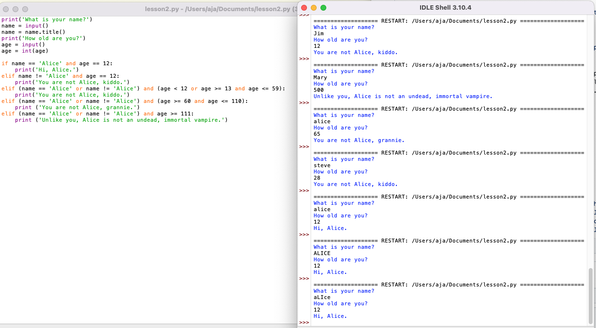

# elif Practice
Description: This program, written in Python 3.10.4, is a modification of a much more rudimentary elif practice example presented in *Chapter 2: Flow Control* of the book [*Automate the Boring Stuff with Python* by Al Sweigart](https://automatetheboringstuff.com/).

## Table of contents

- [Overview](#overview)
  - [Screenshots](#screenshots)
  - [Links](#links)
- [My process](#my-process)
  - [Built with](#built-with)
  - [What I learned](#what-i-learned)
  - [Continued development](#continued-development)
  - [Useful resources](#useful-resources)
- [Author](#author)
- [Acknowledgments](#acknowledgments)
- [The Directions](#frontend-mentor---qr-code-component) 

## Overview
I had a lot of fun making the program my own by applying all that I learned about assigning values to variables, operators, evaluating down to a single Boolean value, functions, and converting strings into integers.  I also applied something I learned in my GDI Python class, the built-in method `name.title()` to capitalize the input.

### Screenshots

| <b>My Code</b> | 
|:--:|
| [](https://raw.githubusercontent.com/Faraja17/elif-practice/main/my-code.png) |


### Links

- [View the execution of my customized program here](https://pythontutor.com/visualize.html#code=print%28'What%20is%20your%20name%3F'%29%0Aname%20%3D%20input%28%29%0Aname%20%3D%20name.title%28%29%0Aprint%28'How%20old%20are%20you%3F'%29%0Aage%20%3D%20input%28%29%0Aage%20%3D%20int%28age%29%0A%0Aif%20name%20%3D%3D%20'Alice'%20and%20age%20%3D%3D%2012%3A%0A%20%20%20%20print%28'Hi,%20Alice.'%29%0Aelif%20name%20!%3D%20'Alice'%20and%20age%20%3D%3D%2012%3A%0A%20%20%20%20print%28'You%20are%20not%20Alice,%20kiddo.'%29%0Aelif%20%28name%20%3D%3D%20'Alice'%20or%20name%20!%3D%20'Alice'%29%20and%20%28age%20%3C%2012%20or%20age%20%3E%3D%2013%20and%20age%20%3C%3D%2059%29%3A%0A%20%20%20%20print%28'You%20are%20not%20Alice,%20kiddo.'%29%0Aelif%20%28name%20%3D%3D%20'Alice'%20or%20name%20!%3D%20'Alice'%29%20and%20%28age%20%3E%3D%2060%20and%20age%20%3C%3D%20110%29%3A%0A%20%20%20%20print%20%28'You%20are%20not%20Alice,%20grannie.'%29%0Aelif%20%28name%20%3D%3D%20'Alice'%20or%20name%20!%3D%20'Alice'%29%20and%20age%20%3E%3D%20111%3A%0A%20%20%20%20print%20%28'Unlike%20you,%20Alice%20is%20not%20an%20undead,%20immortal%20vampire.'%29&cumulative=false&heapPrimitives=nevernest&mode=edit&origin=opt-frontend.js&py=3&rawInputLstJSON=%5B%22ann%22,%2210%22%5D&textReferences=false).

## My process

A fun and engaging program is presented as an example in the elif Statements section of Chapter 2. View the original program from the book here: [vampire](https://autbor.com/vampire/).  I wanted to make the program work no matter the name or age inputted.  I also wanted the program to be interactive.  So, I started out printing the questions and setting name and age to inputs.  Then I replaced the `>` relational operators.  Instead, I created ranges using the `<=` and `>=` relational operators.  I also used the binary Boolean operators `and` and `or` to evaluate more complex expressions to either `True` or `False`.  I did not like that Alice could enter any age and still get the greeting, so I brainstormed the following code, and was so pleased when it worked:

```
elif (name == 'Alice' or name != 'Alice') and (age < 12 or age >= 13 and age <= 59):
    print('You are not Alice, kiddo.')
```

The left side of the expression will always evaluate to `True`, regardless of the name inputted, which means that Alice must enter her correct age in order to get the greeting.  Otherwise, she gets one of the "You are not Alice. . ." messages like everyone else.  Another problem that stumped me for a while was that if a name other than Alice and age 12 were inputted, nothing would print.  I solved that problem by adding an additional elif statement:

```
elif name != 'Alice' and age == 12:
    print('You are not Alice, kiddo.')
```

I wanted Alice to be greeted regardless of whether the name input was in uppercase, lowercase, or a combination of both formats.  First I tried the following:

```
if (name == 'Alice' or name == 'alice' or name = 'ALICE') and age == 12:
    print('Hi, Alice.')
```

This worked, but not for every situation.  Also, it was too repetitive and lengthy.  I then tried researching the topic in the Python documentation.  Finally, I remembered learning how to do this in the GDI Python class.  But when I added `name.title()` it did not have an effect.  Then I realized that after receiving input for the variable `name`, I could set the value of `name` to `name.title()`. It totally worked! This lead me to think about also setting the value of `age` to `int(age)` after receiving input.  This way, I could change the input to an integer before running the if statement, and then I simply could use 'age' throughout all of the expressions. Before, I had used int(age) throughout, which was, again, repetitive and lengthy. It was such a great feeling--getting the program to work exactly as I wanted it to work!

### Built with

- Python 3.10.4

### What I learned

This mini project was very empowering!  It really helped me feel a sense of control and accomplishment!  This book is highly engaging.  The examples are comical; I frequently laugh out loud while practicing. The flow charts in chapter 2 are extremely helpful in teaching me logic.  

### Continued development

I'm looking forward to completing all 20 chapters of the book. In the introduction, it says that there are practice projects that challenge you to improve the practice programs and inspire you to automate similar tasks, so I'm excited to work on those, and update my progress, here on Github. I am also interested in another book by Sweigart: [*The Big Book of Small Python Projects*](https://inventwithpython.com/bigbookpython/).

### Useful resources

- [*Automate the Boring Stuff with Python* by Al Sweigart](https://automatetheboringstuff.com/) - A beginner's guide to Python
- [*The Big Book of Small Python Projects* by Al Swiegart](https://inventwithpython.com/bigbookpython/) - A curated collection of simple Python Projects

## Author

Faraja Thompson

- [My Personal Website](https://faraja17.github.io/my-website/)
- [My Blog: Teacher to Techie](https://faraja17.github.io/)
- [Faraja Thompson, M.Ed. on LinkedIn](https://www.linkedin.com/in/faraja-thompson-m-ed-70885b8/)

## Acknowledgments

I'd like to acknowledge my son and mentor [DeForestt Thompson](https://github.com/DeForestt).  His steadfast support and encouragement keep me motivated!  Thank you for recommending this book, Son <3 <3 <3.
